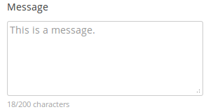

# CS571-Homework-03
## Question 01
What are React Class-Component Hooks and when each one of them is called in the component lifecycle? Put your answer in a new [`Markdown`](https://github.com/adam-p/markdown-here/wiki/Markdown-Cheatsheet) file called `react.md` and add the appropriate markdown syntax.
  
## Question 02 - React programming exercise
We need to count the characters a user type in a text area, just like Twitter's tweet form. With each character the user types we need to update the UI with the new count of characters. Build a class-component that is limited to 200 characters per tweet.
  

  

