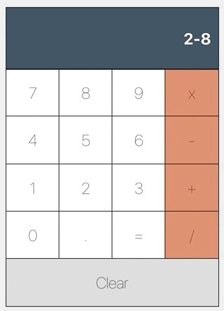

# CS571-Homework-03
* Create a Calculator application using React, that manages the state of a calculator as follows:
```javascript
state = {
current: {n1: number, n2: number, operation: string, result: number}
history: [
      {n1: number, n2: number, operation: string, result: number}, 
      {n1: number, n2: number, operation: string, result: number}
      ]
}
```
Display the history at the side of the calculator.
  

